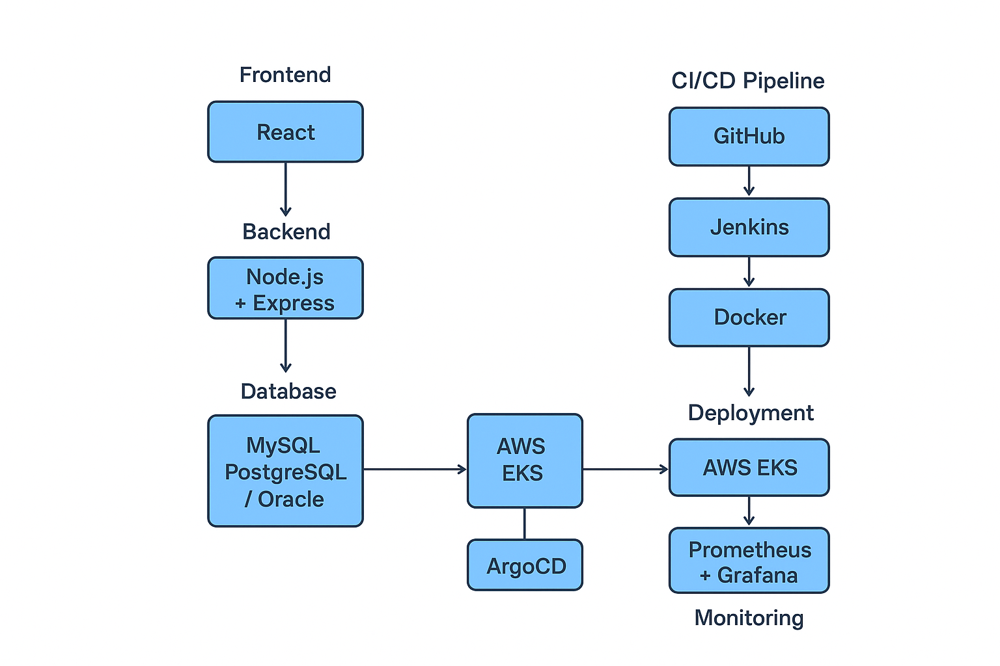
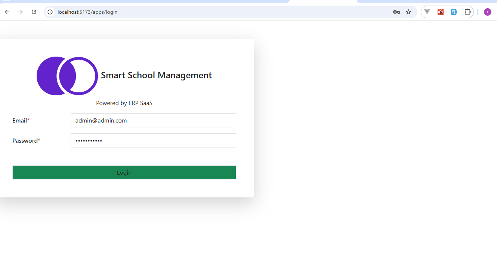
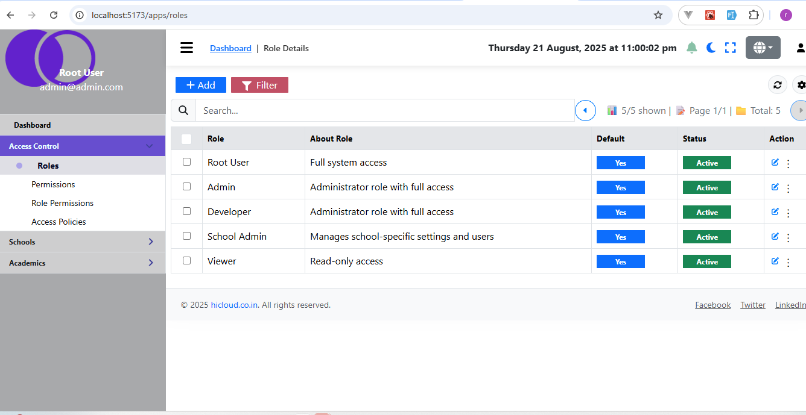
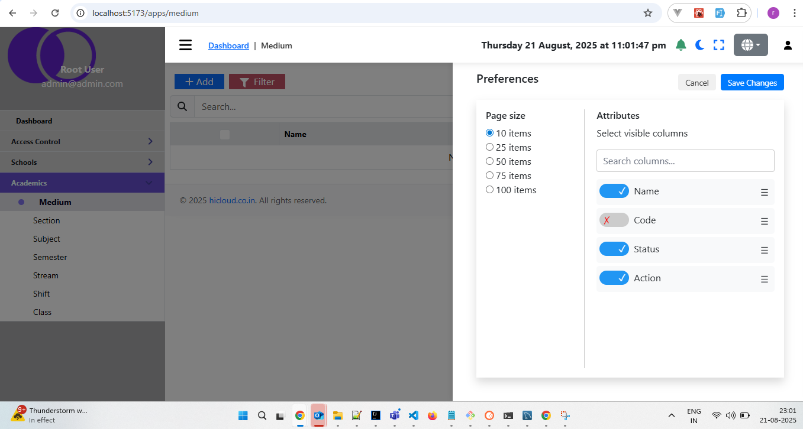

# 📘 School ERP SaaS – React + TypeScript + Vite

[](LICENSE)
[](https://reactjs.org/)
[](https://nodejs.org/)
[](https://www.mysql.com/)
[]()

This is a **School ERP SaaS Platform** built with **React + TypeScript + Vite**.  
The system allows multi-school management, subscription-based SaaS packages, and complete ERP modules (Students, Teachers, Fees, Exams, Library, etc.).  

**Goal:** Build a SaaS platform that allows every school to **smoothly use the application**, manage their administrative and academic operations efficiently, and scale as per their requirements.

---

## 🚀 Key Highlights
- Built **from scratch** ✅  
- Fully **deployed on AWS EKS** using DevSecOps pipeline ✅  
- **Multi-school SaaS platform** with role-based authentication ✅  
- **CI/CD pipeline** integrated (Docker, Jenkins, ArgoCD, Helm) ✅  
- Modern **UI/UX** using TailwindCSS / Bootstrap / ShadCN ✅  
- Secure **DevSecOps practices** (OWASP, SonarQube, Trivy)  

--- 
> Optional: You can add a GIF here showing login/dashboard flow:  
> ``

---

## 🏗 Architecture Overview
  

> [!Note]
> This project will be implemented on Ireland region (eu-west-1).
- <b>Create 1 Master machine on AWS (t2.medium) and 29 GB of storage.</b>
 
 
- <b id="EKS">Create EKS Cluster on AWS</b>
- IAM user with **access keys and secret access keys**
- AWSCLI should be configured  
  ```bash
  curl "https://awscli.amazonaws.com/awscli-exe-linux-x86_64.zip" -o "awscliv2.zip"
  sudo apt install unzip
  unzip awscliv2.zip
  sudo ./aws/install
  aws configure
  - Install **kubectl** 
  ```bash
  curl -o kubectl https://amazon-eks.s3.us-west-2.amazonaws.com/1.19.6/2021-01-05/bin/linux/amd64/kubectl
  chmod +x ./kubectl
  sudo mv ./kubectl /usr/local/bin
  kubectl version --short --client
  ```

- Install **eksctl** 
  ```bash
  curl --silent --location "https://github.com/weaveworks/eksctl/releases/latest/download/eksctl_$(uname -s)_amd64.tar.gz" | tar xz -C /tmp
  sudo mv /tmp/eksctl /usr/local/bin
  eksctl version
  ```
- <b>Create EKS Cluster</b>
  ```bash
  eksctl create cluster --name=sms-erp --region=ec-west-1  --version=1.33  --without-nodegroup
- <b>Associate IAM OIDC Provider</b>
  ```bash
  eksctl utils associate-iam-oidc-provider --region eu-west-1 --cluster bankapp --approve
  ```

 
- <b>Create Nodegroup</b>
  ```bash
  eksctl create nodegroup --cluster=sms-erp \
                       --region=eu-west-1 \
                       --name=sms-erp \
                       --node-type=t2.medium \
                       --nodes=1 \
                       --nodes-min=1 \
                       --nodes-max=1 \
                       --node-volume-size=29 \
                       --ssh-access \
                       --ssh-public-key=eks-sms-erp-key
   ```
> [!Note]
> Before create node group make sure the ssh-public-key ""eks-sms-erp-key is available in your aws account"".

- <b>Install Jenkins for CI/CD</b>
> [!Note]
> If java already configured then skip
```bash
    sudo apt update
    sudo apt install fontconfig openjdk-21-jre
    java -version
    openjdk version "21.0.3" 2024-04-16
    OpenJDK Runtime Environment (build 21.0.3+11-Debian-2)
    OpenJDK 64-Bit Server VM (build 21.0.3+11-Debian-2, mixed mode, sharing)
```
> [!Note]
> If java already configured then skip
```bash
    sudo wget -O /etc/apt/keyrings/jenkins-keyring.asc \
    https://pkg.jenkins.io/debian-stable/jenkins.io-2023.key
    echo "deb [signed-by=/etc/apt/keyrings/jenkins-keyring.asc]" \
    https://pkg.jenkins.io/debian-stable binary/ | sudo tee \
    /etc/apt/sources.list.d/jenkins.list > /dev/null
    sudo apt-get update
    sudo apt-get install jenkins
```

- This part is optional(If you want change the default port) change the default port of jenkins from 8080 to 8081. Because our bankapp application will be running on 8080.
    - Open /usr/lib/systemd/system/jenkins.service file and change JENKINS_PORT environment variable 
    **Enviroment="JENKINS_PORT=8080" 
    - Reload daemon
    ```bash
    sudo systemctl daemon-reload 
    ```
    - Restart Jenkins
    ```bash
    sudo systemctl restart jenkins
    ```
- Install docker
  ```bash
  sudo apt-get install docker.io -y 
  sudo usermod -aG docker $USER && newgrp docker 
  ```
- Install SonarQube and configure
  ```bash
  docker run -itd --name=sonarqube -p 900:9000 sonarqube:lts-community
   ``` 
- Install Trivy and configure
  ```bash
    sudo apt-get install wget apt-transport-https gnupg lsb-release -y
    wget -qO - https://aquasecurity.github.io/trivy-repo/deb/public.key | sudo apt-key add -
    echo deb https://aquasecurity.github.io/trivy-repo/deb $(lsb_release -sc) main | sudo tee -a /etc/apt/sources.list.d/trivy.list
    sudo apt-get update -y
    sudo apt-get install trivy -y
   ``` 
- Install ArgoCD and configure
    - Create namespace 
    ```bash
        kubectl create namespace argocd
    ```
    - Apply menifest file 
    ```bash
        kubectl apply -n argocd -f https://raw.githubusercontent.com/argoproj/argo-cd/stable/manifests/install.yaml
    ```
    - Check pods are running argocd
    ```bash
    watch kubectl get pods -n argocd
    ```
    - Install argocd CLI
    ```bash
        curl --silent --location -o /usr/local/bin/argocd https://github.com/argoproj/argo-cd/releases/download/v2.4.7/argocd-linux-amd64
    ```
    - Change Permission 
    ```bash 
        chmod +x /usr/local/bin/argocd
    ```
    - Check argocd services
    ```bash 
        kubectl get svc -n argocd
    ```
    - Change argocd server's service from ClusterIP to NodePort
    ```bash 
        kubectl patch svc argocd-server -n argocd -p '{"spec":{"type":"NodePort"}}'
    ```
    - Confirm changes services
    ```bash 
        kubectl get svc -n argocd
    ```

    - Initial password of arocd
    ```bash 
        kubectl -n argocd get secret argocd-initial-admin-secret -o jsonpath="{.data.password}" | base64 -d; echo
    ```
    - Username : admin
 
- Add our own eks cluster to argocd for application deployment using cli
    - Login to argoCD from CLI
    ```bash 
        argocd login 32.34.156.178:32738 --username admin
    ```
    - Check how many clusters are available in argocd
    ```bash 
        argocd cluster list
    ```
    - Your cluster lists
    ```bash 
        argocd cluster list
    ```
     - Add your cluster to argocd
    ```bash 
         
    ```
   


**Components:**  
- Frontend: React + TypeScript + Vite  
- Backend: Node.js + Express + Sequelize  
- Database: MySQL / PostgreSQL / Oracle  
- Multi-tenancy & SaaS subscription  
- CI/CD: GitHub → Jenkins → Docker → ArgoCD → AWS EKS  
- Monitoring: Prometheus + Grafana  

---

## 📦 Features
✅ Role-based authentication (Admin, Teacher, Student, Parent)  
✅ Multi-school support (multi-tenancy)  
✅ SaaS subscription packages (Plans, Billing, Subscriptions)  

### ⏳ Coming Soon Features
- Student Management (admissions, attendance, ID cards, report cards)  
- Teacher & Employee Management (payroll, leaves, attendance)  
- Fees & Finance Module (collection, dues, scholarships, reports)  
- Exams & Grading  
- Library Management  
- Transport & Hostel  
- Events & Academic Calendar  
- Communication (messages, notices, announcements)  
- Reports & Analytics  
- System Settings (Roles, Permissions, Integrations, API access)  
- Mobile App (iOS & Android)  
- AI-based Student Performance Analytics  
- Parent-Teacher Chat & Notification System  
- Biometric Attendance Integration  
- Online Exams & Automated Grading  
- Payment Gateway Integration  
- Cloud Backup & Disaster Recovery  
- Advanced Role & Permission Management  
- Multi-language Support  

---

## 🖼 Screenshots & Demo
  
  
  

## ⚡ Getting Started

### 1️⃣ Clone the repo

```bash
git clone https://github.com/rajendrakmr/school-management-system.git
cd school-management-system
